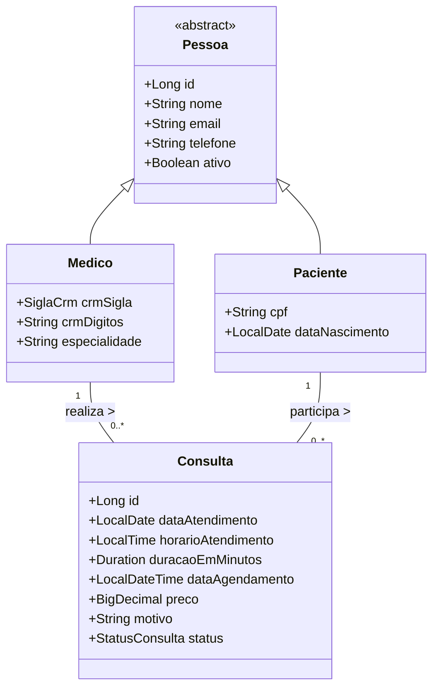

# API de Agendamentos para Consultas Médicas

## Diagrama de classes

```mermaid
classDiagram
    class Pessoa {
        <<abstract>>
        +Long id
        +String nome
        +String email
        +String telefone
        +Boolean ativo
    }

    class Paciente {
        +String cpf
        +LocalDate dataNascimento
    }

    class Medico {
        +SiglaCrm crmSigla
        +String crmDigitos
        +String especialidade
    }

    class Consulta {
        +Long id
        +LocalDate dataAtendimento
        +LocalTime horarioAtendimento
        +Duration duracaoEmMinutos
        +LocalDateTime dataAgendamento
        +BigDecimal preco
        +String motivo
        +StatusConsulta status
    }

    Pessoa <|-- Paciente
    Pessoa <|-- Medico
    Medico "1" -- "0..*" Consulta : realiza >
    Paciente "1" -- "0..*" Consulta : participa >

```
