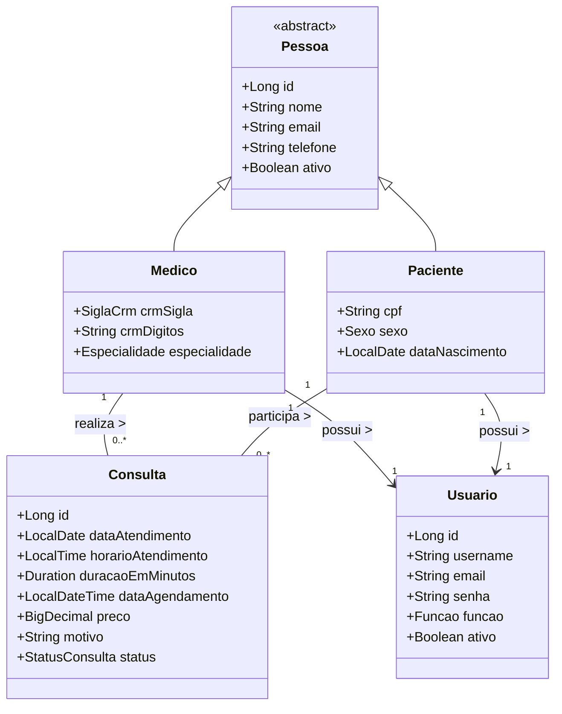

# API de Agendamentos de Consultas Médicas
Aplicação para gerenciamento de consultas médicas, composta por uma API em Spring Boot e um front-end em Angular.
Permite cadastro e controle de pacientes, médicos e consultas, com validação de conflitos de horários no agendamento.
Inclui autenticação e autorização baseadas em JWT, controle de acesso por perfil, tratamento de exceções, relatórios diversos e validação de dados.

Os repositórios do front-end e do back-end são separados, sendo necessário configurar ambos para o funcionamento completo do sistema.

**Repositório do front-end:** [Angular UI - Consultas Médicas](https://github.com/wastecoder/angular-ui-consultas-medicas)


---


## Diagrama de classes



---


## Regras de Autorização por Perfil


### 1. Todos os usuários
- Pode acessar a página inicial e realizar login.
- Pode visualizar informações públicas dos médicos.
- Pode visualizar agenda de médicos disponíveis.
- Pode acessar seus próprios dados e histórico, conforme o perfil.


### 2. Administrador (ADMIN)
- Possui acesso irrestrito a todos os endpoints do sistema.
- Pode visualizar, criar, editar e excluir qualquer entidade:
  - Usuários (de qualquer função)
  - Médicos
  - Pacientes
  - Consultas
- Pode acessar todos os relatórios, incluindo financeiros e operacionais.
- Tem permissão para ativar ou inativar qualquer entidade do sistema.
- Pode alterar senhas e dados de qualquer usuário.


### 3. Recepcionista
- Pode cadastrar e editar:
  - Pacientes
  - Consultas
- Pode visualizar:
  - Todos os médicos
  - Todos os pacientes
  - Todas as consultas
  - Todos os relatórios (produtividade, operacional, financeiro)
- Pode criar usuários do tipo **paciente** ou **médico**.
- Pode cancelar consultas de qualquer paciente.
- Restrições:
  - Editar dados de médicos (exceto agendamentos).
  - Excluir médicos ou pacientes, apenas inativar.
  - Alterar senhas ou dados sensíveis de usuários.


### 4. Médico
- Pode visualizar:
  - Suas próprias consultas
  - Dados dos pacientes que atendeu
  - Horários disponíveis para agendamento
  - Sua própria agenda semanal
- Restrições:
  - Criar ou editar pacientes nem consultas.
  - Visualizar consultas de outros médicos.
  - Acessar relatórios da clínica.
  - Criar usuários ou editar seus próprios dados diretamente.


### 5. Paciente
- Pode visualizar, criar e cancelar **suas próprias consultas**.
- Pode acessar seu histórico de atendimentos.
- Pode alterar seus próprios dados.
- Pode consultar horários disponíveis para marcação.
- Restrições:
  - Visualizar dados de outros pacientes.
  - Editar ou cancelar consultas de terceiros.
  - Acessar relatórios da clínica.


---


## Funcionalidades
- [x] URLs amigáveis seguindo o padrão RESTful.
- [x] Implementação de DTOs:
  - [x] Para validar os dados nas requisições com `Validation`.
  - [x] Para prevenir **Web Parameter Tampering** nas requisições.
  - [x] Para retornar apenas os dados relevantes nas respostas da API.
  - [x] Entidades como Médico, Paciente e Consulta possuem DTOs específicos para respostas formatadas (não é usado para evitar impacto no front-end).
- [x] Configuração de diferentes perfis (`application-{profile}.yml`):
  - [x] **Desenvolvimento**: configuração padrão para testes locais.
  - [x] **Testes:** usado apenas para testes com `H2 Database`.
  - [x] **Produção**: configuração para deploy na nuvem - ex: Railway.
  - [x] **Docker**: com variáveis de ambiente e configuração pronta para containerização.
- [x] Validação na criação e atualização de entidades:
  - [x] Prevenção de dados duplicados (como e-mail, CPF, CRM, etc).
  - [x] Prevenção de sobreposição de horário de agendamentos.
- [x] Elaboração de testes unitários com JUnit:
  - [x] Ativa o perfil de teste com `@ActiveProfiles("test")` quando necessário.
  - [x] Da camada `Repository`, para todas as entidades.
  - [x] Da camada `Service`, utilizando Mockito.
  - [ ] Da camada `Controller`, utilizando Mockito.
- [x] Implementação de controle de acesso com Spring Security
  - [x] Mecanismo de autorização baseado em roles (perfis de acesso).  
  - [x] Proteção de endpoints com base nos papéis de usuário.  
  - [x] Proteção de endpoints específicos para acesso somente do dono dos dados por ID (por exemplo, consultas de pacientes).  
  - [x] Habilitação de segurança a nível de método com `@PreAuthorize` via `@EnableMethodSecurity`.
- [x] Configuração e segurança geral
  - [x] Configuração de um administrador padrão inicial.  
  - [x] Autenticação baseada em JWT, com criptografia assimétrica RSA.  
  - [x] Codificação de senhas com algoritmo seguro `BCrypt`.  
  - [x] Desabilitação do CSRF, por se tratar de uma API REST stateless (sem cookies).
  - [x] Recuperação de senha por e-mail ("esqueci minha senha") — fluxo self-service com token opaco de uso único e TTL curto.
- [x] Tratamento de erros:
  - [x] Apresentação de erros em mensagens informativas, contendo:
    - Mensagem descritiva
    - Código HTTP correspondente
    - Data e hora da exceção
  - [x] Tratamento de exceções globais (como `DataIntegrityViolationException`, `AuthorizationDeniedException`, etc).
- [x] Implementação de relatórios das entidades e operações do sistema, incluindo:
  - [x] Relatórios operacionais.
  - [x] Relatórios financeiros.
  - [x] Relatórios de produtividade.
- [x] Populador de banco de dados:
  - [x] Executado automaticamente ao iniciar a aplicação, se não houver dados nas tabelas.
  - [x] Pode ser desativado no `application.yml`.
  - [x] Cadastra médicos, pacientes e consultas.
  - [x] Metade dos registros é inativada para simular diferentes cenários
  - [x] Consultas geradas apenas em horários válidos:
    - Sem sobreposição
    - Apenas em dias úteis
    - Dentro do horário comercial
- [x] Documentação com Swagger
  - [x] Cada `Controller` possui uma tag com nome e descrição.
  - [x] Cada endpoint possui anotações `@Operation` e `@ApiResponse` com informações detalhadas.
  - [x] Configuração centralizada via SwaggerConfig, incluindo:
    - Autenticação via Bearer Token
    - Informações gerais da API
- [x] Organização dos `Services`
  - [x] Interfaces e Implementações:
    - Para cada service, foi criada uma interface e sua respectiva implementação.
    - Os controllers se comunicam apenas com a interface, promovendo baixo acoplamento.
  - [x] Camada de regras de negócio (`Rules`):
    - Quando necessário, foram criadas classes auxiliares com as regras de negócio utilizadas no service.


---


## Tecnologias Utilizadas
- __Spring Boot:__ Para desenvolvimento da API REST.
- __PostgreSQL:__ Banco de dados relacional.
- __Swagger:__ Documentação da API para facilitar testes e integração.
- __DTOs e Validação:__ Para garantir segurança e consistência dos dados.
- __Spring Security e JWT:__ Autenticação e controle de acesso.
- __Spring Data JPA:__ Para acesso e manipulação do banco de dados.
- __H2 Database:__ Banco de dados em memória para testes.
- __JUnit e Mockito:__ Testes unitários e mocks.
- __spring-boot-starter-mail (Mailtrap em dev):__ Envio de e-mails de redefinição de senha.
- __Angular:__ Front-end para interação com a API.
- __Docker:__ Containerização da aplicação para facilitar deploy.
- __Maven:__ Gerenciamento de dependências e build do projeto.


---


## 🔑 Recuperação de senha

Fluxo self-service de "esqueci minha senha" — funciona para qualquer perfil (ADMIN, RECEPCIONISTA, MÉDICO, PACIENTE), desde que o `Usuario` tenha e-mail cadastrado.

### Endpoints
- `POST /auth/forgot-password` — body `{ "email": "..." }`. Sempre responde **204 No Content** (não revela se o e-mail está cadastrado). Se houver `Usuario` ativo com aquele e-mail, gera um token opaco (UUID, TTL **15 min**) e envia o link de redefinição por e-mail. Limitado a **3 solicitações/hora** por par IP+e-mail.
- `POST /auth/reset-password` — body `{ "token": "...", "novaSenha": "..." }`. Valida o token (existe, não usado, não expirado), troca a senha (BCrypt) e **revoga todos os refresh tokens** do usuário, forçando logout das sessões abertas.

### Configuração necessária

Variáveis de ambiente (ver `.env.example`):

```bash
# URL pública do front-end (usada para montar o link no e-mail)
APP_FRONTEND_URL=http://localhost:4200
APP_PASSWORD_RECOVERY_REMETENTE=noreply@consultas-medicas.local

# SMTP em dev: Mailtrap sandbox (https://mailtrap.io)
MAILTRAP_USERNAME=...
MAILTRAP_PASSWORD=...

# SMTP em prod (ex.: SendGrid, AWS SES)
SPRING_MAIL_HOST=smtp.sendgrid.net
SPRING_MAIL_USERNAME=apikey
SPRING_MAIL_PASSWORD=...
```

### Migration do campo `email` em `Usuario`

A entidade `Usuario` ganhou o campo `email NOT NULL UNIQUE`. Em dev (`ddl-auto: update`) a coluna é criada automaticamente, mas falha se a tabela já estiver populada — recrie o schema local ou rode manualmente:

```sql
ALTER TABLE usuario ADD COLUMN email VARCHAR(100);
UPDATE usuario u SET email = (SELECT m.email FROM medico m WHERE m.usuario_id = u.id) WHERE email IS NULL;
UPDATE usuario u SET email = (SELECT p.email FROM paciente p WHERE p.usuario_id = u.id) WHERE email IS NULL;
UPDATE usuario SET email = 'admin@consultas-medicas.local' WHERE email IS NULL AND username = 'admin';
ALTER TABLE usuario ALTER COLUMN email SET NOT NULL;
ALTER TABLE usuario ADD CONSTRAINT uk_usuario_email UNIQUE (email);
```

Em prod (`ddl-auto: validate`), executar o SQL acima manualmente antes do deploy.


---


## 📊 Relatórios da Clínica


### 👨‍⚕️ Relatório Médico
- Quantidade de consultas realizadas, agrupadas por médico
- Lista dos médicos com mais consultas em um mês específico (requer mês e ano)
- Quantidade de médicos agrupados por especialidade
- Taxa de cancelamentos (%) por médico
- Valor total faturado por médico, com base nas consultas realizadas


### 🧑‍🤝‍🧑 Relatório de Paciente
- Histórico completo de consultas de um paciente específico (realizadas, agendadas e canceladas)
- Quantidade de cancelamentos de consultas, agrupadas por paciente
- Pacientes que mais realizaram consultas em um intervalo de datas (requer data de início e fim)
- Quantidade de pacientes agrupados por sexo
- Quantidade de pacientes agrupados por faixa etária


### 🗓️ Relatório de Consultas
- Quantidade de consultas agrupadas por status (AGENDADA, CANCELADA, REALIZADA)
- Quantidade de consultas agrupadas por mês (todos os anos)
- Quantidade de consultas agrupadas por ano
- Quantidade de consultas agrupadas por especialidade médica
- Lista de todas as consultas de um paciente específico (requer ID do paciente)
- Lista de todas as consultas de um médico específico (requer ID do médico)
- Lista de consultas em um intervalo de datas (requer data de início e fim)


### ⚙️ Relatório Operacional
- Lista de consultas marcadas em uma data específica (padrão: data atual)
- Consultas agendadas para os próximos 7 dias
- Consultas agendadas em datas passadas que ainda não foram realizadas (pendentes)
- Médicos sem nenhuma consulta agendada no mês especificado (padrão: mês atual)


### 💰 Relatório Financeiro
- Valor total faturado por mês, considerando consultas realizadas
- Valor total faturado por médico
- Valor total faturado por especialidade médica
- Valor total faturado num intervalo de datas (requer data de início e fim)
- Valor total perdido devido a cancelamentos de consultas
- Valor perdido por cancelamentos, agrupado por mês e ano
- Valor perdido por cancelamentos em um intervalo de datas (requer data de início e fim)


### 📊 Relatório de Produtividade
- Quantidade de consultas por mês, filtradas por status (REALIZADA, AGENDADA, CANCELADA)
- Média de consultas realizadas por dia, semana e mês
- Tempo médio de duração das consultas realizadas (em minutos)
- Tempo médio entre o agendamento e o atendimento (em dias)
- Taxa de comparecimento dos pacientes (consultas realizadas ÷ agendadas)
